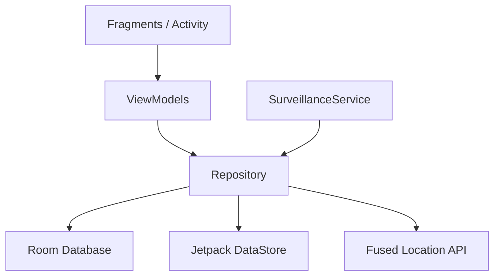

# GuardianTrack 🛡️

GuardianTrack is a mobile safety system for Android that detects falls and low battery events to alert emergency contacts.

## 🛠️ Prerequisites
*   **Android Studio**: Ladybug (2024.2.1) or newer.
*   **JDK**: Version 17.
*   **Android SDK**: Target 36 (Android 15), Min 26 (Android 8.0).
*   **Hardware**: Physical device with an **Accelerometer** and **GPS**.

## 🏗️ Architecture (MVVM)
The project follows a clean **Model-View-ViewModel** architecture:

- **UI**: Dashboard, History, and Settings.
- **ViewModels**: Manage state and logic for each screen.
- **Repository**: Central source of truth for location and incident data.
- **SurveillanceService**: A Foreground Service that handles real-time fall detection on a dedicated background thread.

## 📦 Core Dependencies
- **Hilt**: Dependency injection.
- **Room**: Local incident storage.
- **DataStore**: Encrypted preferences.
- **Play Services Location**: Real-time GPS coordinates.
- **Coroutine/Flow**: Asynchronous stream processing.

## 🚀 How to Build
1.  Open the project in **Android Studio**.
2.  Wait for **Gradle** sync.
3.  Connect a physical Android device.
4.  Click **Run** (`Shift+F10`) or **Build** (`Ctrl+F9`).

---
*For a deeper dive into the physics of the fall detection algorithm (§2.2), see the [Architecture Guide](file:///d:/GuardianTrack/Architecture_Guide.md).*
